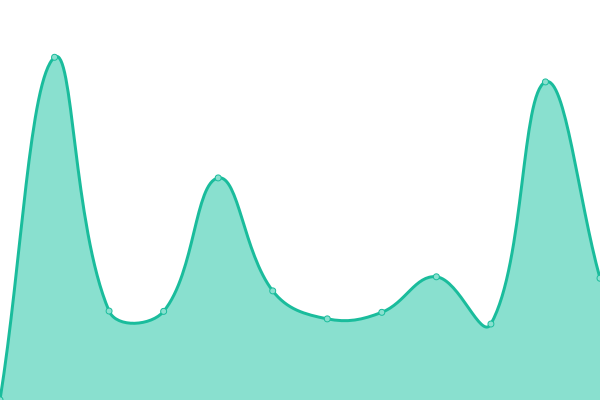

# [📈 Live Status](https://uptime.itishermann.me): <!--live status--> **🟧 Partial outage**

This repository contains the open-source uptime monitor and status page for [Hermann Kao](https://itishermann.me), powered by [Upptime](https://github.com/upptime/upptime).

With [Upptime](https://upptime.js.org), you can get your own unlimited and free uptime monitor and status page, powered entirely by a GitHub repository. We use [Issues](https://github.com/itishermann/uptime/issues) as incident reports, [Actions](https://github.com/itishermann/uptime/actions) as uptime monitors, and [Pages](https://uptime.itishermann.me) for the status page.

<!--start: status pages-->
<!-- This summary is generated by Upptime (https://github.com/upptime/upptime) -->
<!-- Do not edit this manually, your changes will be overwritten -->
<!-- prettier-ignore -->
| URL | Status | History | Response Time | Uptime |
| --- | ------ | ------- | ------------- | ------ |
|  [10k-steps](https://10k-steps.itishermann.me) | 🟩 Up | [10k-steps.yml](https://github.com/itishermann/uptime/commits/HEAD/history/10k-steps.yml) | 

 204ms
     
 | 

<a href="https://uptime.itishermann.me/history/10k-steps">99.78%</a>
    

|  [Dokploy](https://dokploy.itishermann.me) | 🟩 Up | [dokploy.yml](https://github.com/itishermann/uptime/commits/HEAD/history/dokploy.yml) | 

 503ms
     
 | 

<a href="https://uptime.itishermann.me/history/dokploy">99.62%</a>
    

|  [InvoiceNinja](https://invoiceninja.itishermann.me) | 🟥 Down | [invoice-ninja.yml](https://github.com/itishermann/uptime/commits/HEAD/history/invoice-ninja.yml) | 

 660ms
     
 | 

<a href="https://uptime.itishermann.me/history/invoice-ninja">98.78%</a>
    

|  [Log To](https://auth.itishermann.me) | 🟩 Up | [log-to.yml](https://github.com/itishermann/uptime/commits/HEAD/history/log-to.yml) | 

 782ms
     
 | 

<a href="https://uptime.itishermann.me/history/log-to">99.62%</a>
    

|  [Log to admin](https://logto.itishermann.me) | 🟩 Up | [log-to-admin.yml](https://github.com/itishermann/uptime/commits/HEAD/history/log-to-admin.yml) | 

 769ms
     
 | 

<a href="https://uptime.itishermann.me/history/log-to-admin">99.54%</a>
    

|  [Mediation Immobilière](https://mediation-immobiliere.com) | 🟥 Down | [mediation-immobiliere.yml](https://github.com/itishermann/uptime/commits/HEAD/history/mediation-immobiliere.yml) | 

 735ms
     
 | 

<a href="https://uptime.itishermann.me/history/mediation-immobiliere">99.16%</a>
    

|  [Play Pulse (Client)](https://play-pulse.itishermann.me) | 🟩 Up | [play-pulse-client.yml](https://github.com/itishermann/uptime/commits/HEAD/history/play-pulse-client.yml) | 

 180ms
     
 | 

<a href="https://uptime.itishermann.me/history/play-pulse-client">99.78%</a>
    

|  [Turbo cache](https://turbo.itishermann.me) | 🟥 Down | [turbo-cache.yml](https://github.com/itishermann/uptime/commits/HEAD/history/turbo-cache.yml) | 

 1007ms
     
 | 

<a href="https://uptime.itishermann.me/history/turbo-cache">98.78%</a>
    

|  [Kaptaain (client)](https://app.kaptaain.com/api/health) | 🟩 Up | [kaptaain-client.yml](https://github.com/itishermann/uptime/commits/HEAD/history/kaptaain-client.yml) | 

 740ms
     
 | 

<a href="https://uptime.itishermann.me/history/kaptaain-client">100.00%</a>
    

|  [Kaptaain (server)](https://api.kaptaain.com/health) | 🟩 Up | [kaptaain-server.yml](https://github.com/itishermann/uptime/commits/HEAD/history/kaptaain-server.yml) | 

 642ms
     
 | 

<a href="https://uptime.itishermann.me/history/kaptaain-server">100.00%</a>
    

<!--end: status pages-->

[**Visit our status website →**](https://uptime.itishermann.me)

## 📄 License

- Powered by: [Upptime](https://github.com/upptime/upptime)
- Code: [MIT](./LICENSE) © [Anand Chowdhary](https://anandchowdhary.com), supported by [Pabio](https://pabio.com)
- Data in the `./history` directory: [Open Database License](https://opendatacommons.org/licenses/odbl/1-0/)
